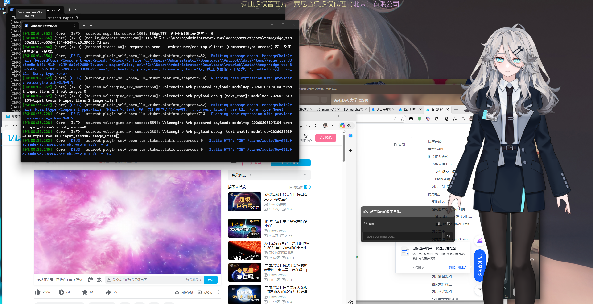
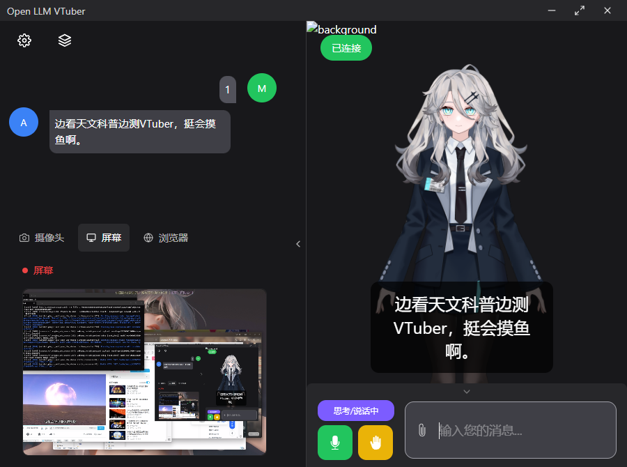
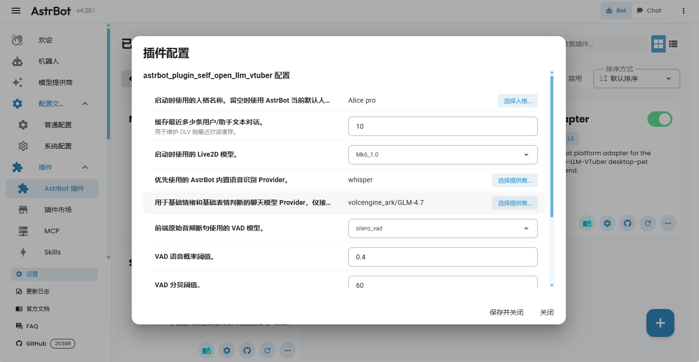
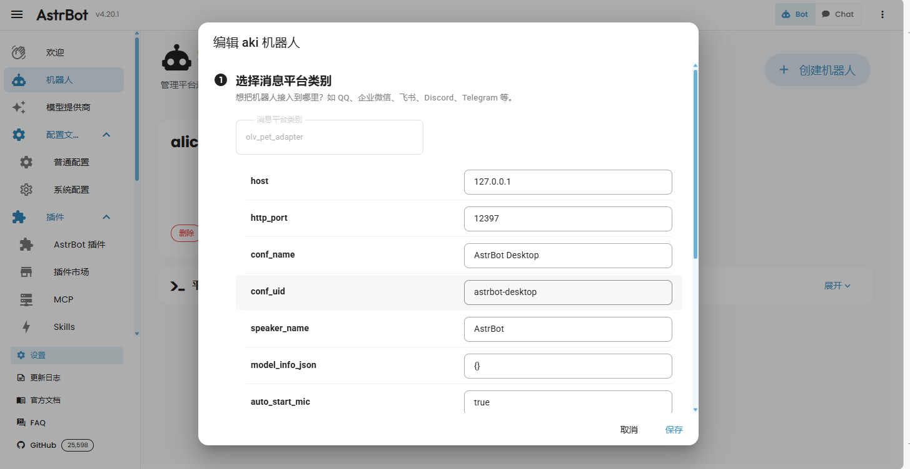

# Alice的桌面分身（astrbot_plugin_self_open_llm_vtuber）

让你的bot在桌面或者web可以看到你、看到你在干什么、“开口说话、做表情、播动作”。这个插件负责把 AstrBot 的对话结果实时变成可视化桌宠互动，支持文本输入、语音输入和语音打断。

- 前端仓库：[murphys7017/astrbot_plugin_self_open_llm_vtuber_web](https://github.com/murphys7017/astrbot_plugin_self_open_llm_vtuber_web)
- 插件仓库：[murphys7017/astrbot_plugin_self_open_llm_vtuber](https://github.com/murphys7017/astrbot_plugin_self_open_llm_vtuber)
- 平台适配器 ID：`olv_pet_adapter`

> 本插件不是独立后端服务，必须放在 AstrBot 插件目录内运行。

## 快速导航

- [功能特色](#功能特色)
- [安装与启用](#安装与启用)
- [快速使用](#快速使用)
- [常见问题](#常见问题)
- [文档索引](#文档索引)

## 效果预览






## 功能特色

- 让 Alice 的回复变成“能听见、能看见”的桌面互动
- 支持文本、图片、麦克风输入并接入 AstrBot 对话链路
- 支持语音识别、语音播放、表情与动作联动
- 支持语音打断，提升实时对话体验
- 支持动态下发 Live2D 模型信息与音频 URL 播放链路

## 安装与启用

### 1. 放入 AstrBot 插件目录

```text
AstrBot/data/plugins/astrbot_plugin_self_open_llm_vtuber
```

### 2. 安装 Python 依赖

```powershell
pip install -r requirements.txt
```

### 3. 安装 ffmpeg

插件会通过 `pydub` 处理音频缓存，请确保系统已安装 `ffmpeg` 且可在 `PATH` 中访问。

### 4. 启动 AstrBot 并确认插件加载

正常情况下日志会出现：

- `OLV Pet Adapter websocket listening on ws://127.0.0.1:12396`
- `Desktop VTuber static resources listening on http://127.0.0.1:12397`

## 快速使用

### 1. 启动前端

在前端项目目录执行：

```powershell
npm install
npm run dev
```

### 2. 配置前端连接地址

- `wsUrl`: `ws://127.0.0.1:12396`
- `baseUrl`: `http://127.0.0.1:12397`

如果前端和 AstrBot 不在同一台机器，请替换为 AstrBot 实际 IP。

### 3. 开始对话

连接成功后，前端输入会进入 AstrBot 对话链路，返回内容会以文本、音频、表情和动作形式回到前端。

## 常见问题

### 前端连接不上

- 检查 AstrBot 是否已启动且插件已加载
- 检查 `12396` / `12397` 是否被占用
- 检查前端 `wsUrl` / `baseUrl` 是否填写正确
- 检查防火墙与跨机器网络连通性

### 没有音频

- 检查 AstrBot 是否启用了可用的 TTS Provider
- 检查 `ffmpeg` 是否可用
- 检查插件数据目录下 `cache/audio/` 是否生成 wav 缓存

### 麦克风输入无反应

- 检查 `stt_provider_id` 对应 Provider 是否可用
- 检查前端是否发出了 `mic-audio-data` / `mic-audio-end`
- 若使用 `raw-audio-data`，确认 `silero-vad` 可用

## 文档索引

- 配置参考：[docs/configuration.md](docs/configuration.md)
- 技术说明（架构、协议、运行链路）：[docs/technical-overview.md](docs/technical-overview.md)
- 协议基线（字段级）：[docs/protocol_baseline.md](docs/protocol_baseline.md)
- 排障手册：[docs/troubleshooting.md](docs/troubleshooting.md)
- 联调审阅记录：[docs/审阅结果.md](docs/审阅结果.md)
